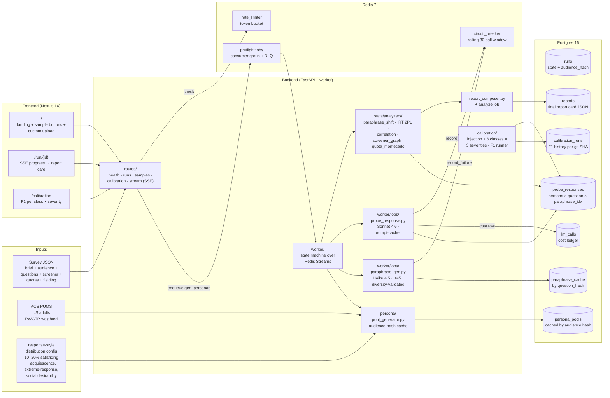
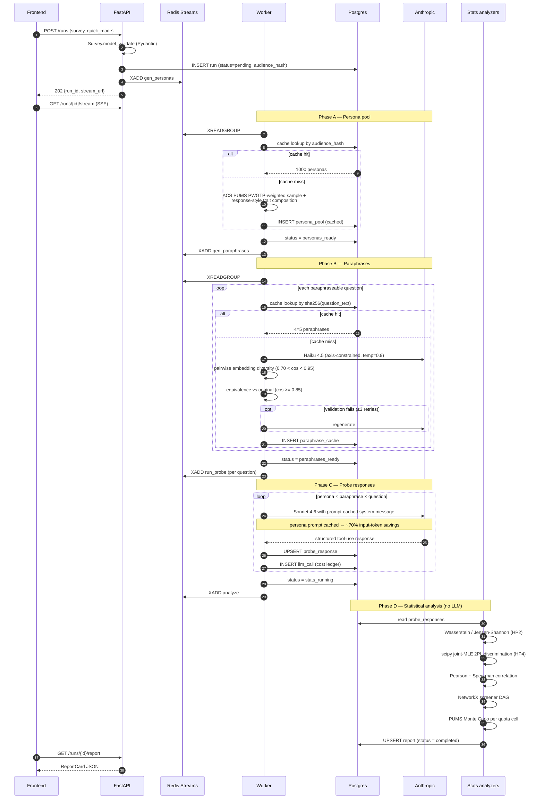
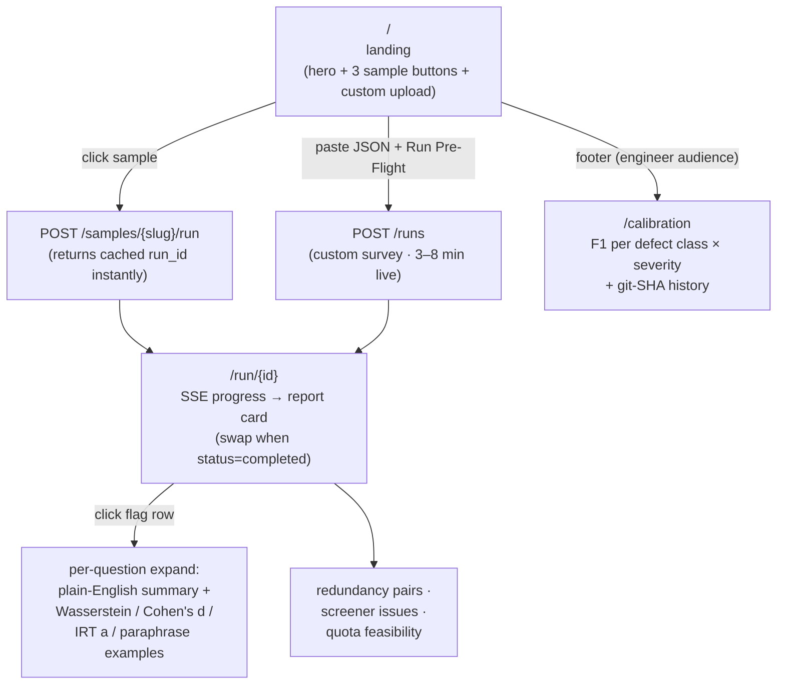

# Pre-Flight

A working proof-of-concept for the layer Knit's "Researcher-Driven AI" workflow
is missing today. Knit already markets the post-fielding side beautifully —
anomaly detection, video respondent validation, AI+human respondent QA, live
fielding checks. This build explores what the **30 seconds before a survey
hits the panel** could look like when the draft is **probed by a calibrated
persona swarm against the actual wording**, **flagged with concrete numerical
evidence (not LLM-as-judge yes/no)**, and **calibrated against defect injection**
so the headline F1 number can never be cherry-picked.

Two audiences in one product:

- **Researcher** → upload (or pick a sample) survey → 60-second report card with per-question severity, plain-English summaries ("wording inflates response by 1.3 points on a 5-point scale"), redundant pairs, infeasible quota cells, skip-logic defects → fix flags before launch
- **Engineer / oncall** → `/calibration` shows F1 per defect class × severity on a held-out injection corpus, regression-tracked across git SHAs — proves the detector isn't theatre

**Critically: probes are used for instrument stress-testing, not population response prediction.** Recent literature ([Hullman et al](https://mucollective.northwestern.edu/files/Hullman-llm-behavioral.pdf), [arxiv:2507.02919](https://arxiv.org/pdf/2507.02919)) shows LLM persona simulation suffers from homogenization and structural inconsistency on absolute response prediction. We do not make that claim. We use LLM *sensitivity to wording perturbation* as the signal.

## Architecture



## Request flow

How one draft survey becomes a report card. Every step is independently testable; persona pools and paraphrases are cached so iteration on the same survey is cheap, and the demo path uses pre-computed reports so the 60-second test is instant.



## UI flow

A researcher's path through the product. Every page is a server component except the SSE-driven run progress (browser API) and the report-card drill-downs (interactive expand).



## Patterns

| Pattern | File | What it solves |
| --- | --- | --- |
| Async run state machine | `preflight/worker/state.py`, `dispatcher.py` | Pipeline is resumable + debuggable; "this run got stuck at `paraphrases_ready`" tells you exactly where |
| Idempotent probe upsert | `probe_responses` PK = `(run_id, persona_id, question_id, paraphrase_idx)` | Mid-run worker crash → re-run converges; never duplicates LLM cost |
| Audience-hash persona cache | `persona/pool_generator.py:audience_hash` | 1000-persona pool reused across runs with identical audience constraints; ~$0 marginal for repeat audiences |
| Question-hash paraphrase cache | `worker/jobs/paraphrase_gen.py:question_hash` | Same question text across runs → zero Haiku spend after first generation |
| Anthropic prompt caching | `llm/anthropic_client.py:_build_system` | Persona system prompt cached at ephemeral tier → ~70% reduction on input-token cost |
| Probes-not-predictions framing in code AND UI | `stats/types.py`, `frontend/components/ReportCard.tsx` | Recent literature kills the silicon-sample claim; we use *sensitivity to perturbation* as signal and disclose it in-band |
| Counterfactual paraphrase probing | `stats/analyzers/paraphrase_shift.py` | Wording-bias detector with concrete numeric evidence: "original μ=4.32 vs neutral μ=2.98 → 1.34-pt inflation" |
| Pairwise diversity gate on paraphrases | `worker/jobs/paraphrase_gen.py:_validate_paraphrases` | Prevents LLM-collapsed paraphrases (cos > 0.95) from killing the signal; rejects + regenerates up to 3× |
| Closed-form 2PL via scipy | `stats/analyzers/irt.py:_fit_2pl` | Avoids 200MB Pyro/py-irt dependency; convergence-fragile cases fall back to variance proxy with explicit "experimental" tag |
| ACS PUMS weighted joint sampling | `persona/pums_loader.py:weighted_sample` | Persona demographics preserve real-world joint distributions (income × education × age); avoids the "incongruous persona" failure mode the literature documents |
| Response-style trait layer | `persona/style_composer.py` | 10–20% satisficing per POQ literature; surveys break in the low-effort tail first — uniform optimizers miss everything |
| Defect-injection calibration | `calibration/runner.py`, `injection/registry.py` | F1 calibration on planted defects — NOT on predicting respondent answers — is the only defensible eval given the literature |
| Per-severity F1 breakdown | `calibration/metrics.py`, `/calibration` page | Aggregate F1 sits next to subtle/moderate/obvious split → headline number can't be cherry-picked |
| Pre-computed sample reports | `seeds/precompute_reports.py`, `cli.py:cmd_precompute_samples` | 60-second demo path: cached samples return instantly without live LLM cost; custom uploads still run end-to-end |
| Hand-authored neutral paraphrases for samples | `seeds/precompute_reports.py:ANNOTATIONS` | UI shows real before/after wording instead of `<paraphrase>` placeholder; researcher sees what "neutral" actually looks like |
| Plain-English summary on every flag | `stats/analyzers/*.py:_summarize_*` | Researcher reads "wording inflates by 1.34 pts" instead of decoding `Wasserstein 1.453`; metrics stay below for power users |
| Rolling-window circuit breaker | `llm/circuit_breaker.py` | 50% failure ratio over last 30 calls → open for 30s; half-open probes recover transparently; 429s don't cascade |
| Token-bucket rate limit | `llm/rate_limiter.py` | Anthropic Tier 4 ceiling enforced client-side at 50 RPS sustained, 60 concurrent |
| Pydantic URL normalization | `config.py:_normalize_async_postgres` | Railway / Heroku inject `postgresql://`; SQLAlchemy needs `postgresql+asyncpg://` — handled at config load, deploy targets stay agnostic |
| Structured JSON logging | `preflight/logging.py` | `docker compose logs api \| jq` works; same shape as Logfire / Datadog |
| Per-call cost ledger | `llm/anthropic_client.py`, `llm_calls` table | Every Anthropic call is one row with input/output/cache tokens + computed USD; daily cap enforceable from real numbers, not estimates |

## Tech stack

**Backend** (`preflight/`)

- Python 3.12+ · FastAPI 0.115 · SQLAlchemy 2 (async) · asyncpg 0.30
- Postgres 16 · Alembic 1.13
- Redis 7 (Streams + circuit breaker + rate limit)
- Anthropic SDK ≥0.39 (tool-use for structured output across paraphrase generation and probe responses; specific model ids env-config: Sonnet 4.6 + Haiku 4.5)
- pandas + pyarrow (PUMS slice as parquet) · scipy 1.14 (Wasserstein, Jensen-Shannon, joint-MLE 2PL) · NetworkX 3.4 (screener DAG)
- sentence-transformers (`all-MiniLM-L6-v2`, ~80MB local model — paraphrase equivalence + diversity validation; no API cost)
- structlog 24.4 · tenacity 9.0 · pydantic 2.9 · pydantic-settings 2.6

**Frontend** (`frontend/`)

- Next.js 16.2 + React 19 + TypeScript · Tailwind 4 (CSS-first config, no `tailwind.config.ts`)
- No external UI library — handcrafted Tailwind components keep bundle and maintenance cost minimal
- SSE for run progress · server components everywhere except the run page (interactive)

**Infra**

- Docker Compose (`docker-compose.yml`) — Postgres 16-alpine + Redis 7-alpine + API + worker; host ports 55434 (Postgres) / 55435 (Redis) to avoid collisions
- Railway (backend, two services on the same Dockerfile: API + worker) + Vercel (frontend)
- GitHub Actions: pytest against postgres+redis service containers (`test.yml`) + nightly calibration regression (`calibration.yml`) — F1 drop > 2% blocks merge

## Key trade-offs

Deliberate choices where the simpler option beats the orthodox one:

- **Probes-not-predictions over silicon sampling.** The naive thing is to claim our LLM personas predict respondent answers. Recent literature kills that claim. We use LLM *sensitivity to wording perturbation* as the signal, calibrate against defect injection rather than response-distribution fidelity, and disclose the framing in the UI itself. Defensible against "but LLMs can't simulate humans" — agreed; we don't.
- **Defect-injection calibration over MAPE on response distributions.** Cherry-picked response-prediction MAPE is what most synthetic-respondent demos report; it doesn't survive scrutiny. Defect injection (clean Pew/ANES instruments × planted defects × 3 severity levels) yields a reproducible F1 number with an honest precision/recall breakdown. The headline always sits next to the per-class split.
- **In-process scipy 2PL over Pyro/py-irt.** Pyro adds 200+MB and slows cold-start; joint MLE in scipy is ~50 lines and handles our scale (8–25 items × hundreds of personas). The fit is convergence-fragile on synthetic data — when it fails we surface a variance proxy and tag the flag "experimental" rather than fabricating a number.
- **Hand-authored sample paraphrases over live LLM at precompute.** The precompute path generates sample report cards without Anthropic spend. Hand-writing 5 neutral paraphrases per sample question (~100 strings total) gives the demo UI real before/after wording — vs the `<paraphrase>` placeholder bug that surfaced when this shipped without it.
- **Cache key incorporates audience + response-style + seed.** A persona pool is reused only when audience constraints, response-style proportions, AND seed all match. Tightening the age range gets a fresh pool (correct); re-running the identical survey hits cache (correct).
- **Anthropic prompt caching on the persona system prompt.** Sonnet probe calls share the same persona description across 30+ questions. Marking it `cache_control: ephemeral` cuts billable input tokens ~5× compared to full re-sends. The user message holds the question text (varies per call, uncached). Single biggest cost lever in the system.
- **In-process classifier orchestration over a worker fleet.** Architecture doc reserves Redis Streams for scale; in code one worker process handles the consumer group. At Knit-demo volume (3 sample surveys + occasional custom uploads) this is fine. Streams is a one-flag change to scale out.
- **Pre-computed sample reports for the 60-second demo path.** Live LLM-bound runs can't finish in 60 seconds at any reasonable budget (~54k Sonnet calls per 30-question survey). The cached-sample path returns the full report card from Postgres in <1s; the calibration page proves reproducibility. Custom uploads still run end-to-end with honest 3–8 minute SSE progress.
- **PUMS synthetic fallback for local dev.** The real US-adults filtered parquet ships via `scripts/prepare_pums.py` (run once); the loader falls back to a synthetic dataset if the parquet is missing, with a loud warning. Production code paths cannot silently use the synthetic fallback.

## Quickstart

```bash
# 1. Bring up Postgres and Redis
docker compose up -d postgres redis
# Postgres on host port 55434, Redis on 55435 (non-standard to avoid
# collisions with anything else you have running locally).

# 2. Install Python deps + run migrations
python3.13 -m venv .venv
.venv/bin/pip install -e ".[dev]"
.venv/bin/alembic upgrade head

# 3. Seed sample surveys + precompute their report cards (no LLM cost)
.venv/bin/python -m preflight.cli seed-samples
.venv/bin/python -m preflight.cli precompute-samples
.venv/bin/python -m preflight.cli calibrate \
    --n-clean 30 --n-personas 400 --n-sub-swarm 100

# 4. (Optional) Add ANTHROPIC_API_KEY for live custom runs. Sample reports
# work fine without it — they ship pre-computed.
echo "ANTHROPIC_API_KEY=sk-ant-..." > .env

# 5. Start the API (port 8000) and the worker (separate process; only
# needed for live custom uploads)
.venv/bin/uvicorn preflight.main:app --port 8000
.venv/bin/python -m preflight.worker.main   # in another terminal

# 6. Start the web (port 3000)
cd frontend
npm install
npm run dev
```

Then open:

- http://localhost:3000 — landing
- http://localhost:3000/run/{sample-02-uuid} — defect-bearing report (3 high-severity questions, infeasible quota cell)
- http://localhost:3000/calibration — F1 dashboard
- http://localhost:8000/docs — FastAPI auto-generated OpenAPI

## Tests

```bash
.venv/bin/pytest -q
```

139 pytest cases. Some highlights:

- `test_paraphrase_shift.py` — Wasserstein on identical distributions = 0; uniform-lift across paraphrases triggers `score > 1.0` and `Cohen's d < -0.5`; categorical full-swap detection
- `test_irt.py` — Spearman rank correlation between true and fitted discrimination ≥ 0.6 on synthetic 2PL data (joint MLE is non-convex; perfect recovery is not the criterion)
- `test_screener_graph.py` — clean survey → no flags; self-loop, forward reference (Q1 conditioned on Q5), unknown dependency, type-incompatible conditional value, contradicting screener rules all fire
- `test_quota_montecarlo.py` — wide audience + wide cell → feasible; narrow audience + contradicting cell (25-34 audience asking 55-64 quota) → 0% panel match, severity HIGH
- `test_paraphrase_validation.py` — generation rejects collapsed (cos > 0.95) and over-divergent (cos < 0.70) sets; equivalence floor 0.85 against original
- `test_circuit_breaker.py` — 50% failure ratio over rolling 30-call window opens the circuit; half-open probes after 30s cooldown
- `test_precompute_reports.py` — every sample question has ≥5 paraphrases; no `<paraphrase>` placeholder leaks through; every flag class carries a `summary` field for plain-English UI
- `test_config.py` — `postgres://`, `postgresql://`, and `postgresql+asyncpg://` URLs all normalize correctly so deploy targets (Railway / Heroku / Supabase) are interchangeable

CI runs the full suite against postgres + redis service containers in GitHub Actions, plus a nightly calibration regression that posts F1 drop alerts to PRs.

## Deploy

Sized for a single-region single-host deployment:

- **Backend (api + worker)** → Railway, two services on the same Dockerfile, different start commands. `railway.json` configures the API; the worker service uses `python -m preflight.worker.main`. Migrations run as part of the API start command (`alembic upgrade head`).
- **Frontend** → Vercel, Next.js 16. `vercel.json` pins `rootDirectory: frontend` and binds `NEXT_PUBLIC_API_BASE` to the Railway backend URL via project env vars.
- **Database** → Railway managed Postgres (no extensions needed; pure-SQL workload).
- **Cache + circuit breaker + rate limit** → Railway managed Redis.
- **Cost ceiling** — Anthropic spend cap at $50/mo with alarm at $25; per-run cost projection in `llm_calls` table sums to dashboard-reportable numbers.

Critical gotchas baked into the code: Dockerfile copies source before pip install (editable install needs source present at install time); Pydantic validator normalizes hosted-Postgres URL schemes to asyncpg form automatically; sample seeding requires `seeds/` directory in the image (Dockerfile copies it).

---

Repo: https://github.com/krish1236/preflight (placeholder; update once pushed)
